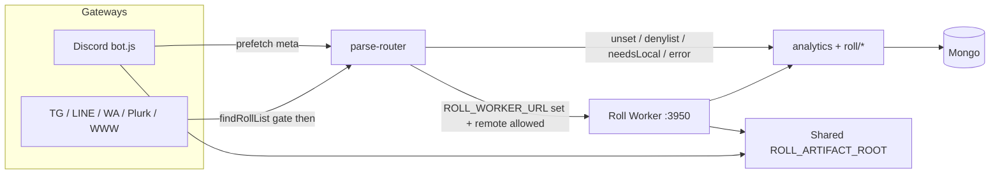

# Roll Worker (Gateway / Backend split)

## Goal

- **Gateways** (Discord / TG / LINE / WA / Plurk / WWW) stay online.
- **Roll Worker** runs `analytics` + `roll/*` and can restart independently.

## Quick start (single machine)

1. Start worker:

```bash
yarn start:roll-worker
```

2. On each gateway process, set:

```env
ROLL_WORKER_URL=http://127.0.0.1:3950
ROLL_WORKER_TOKEN=change-me-shared-secret
```

3. Start gateways as usual (`yarn start` / docker discord vs non-discord).

Without `ROLL_WORKER_URL`, behavior is unchanged (in-process analytics).

**Auth:** set the same `ROLL_WORKER_TOKEN` on worker and every gateway. Worker refuses to start without a token unless `ROLL_WORKER_ALLOW_NO_TOKEN=true` (local tests only; non-loopback bind refused). Gateways attach an HMAC signature (`_gatewayAuth`) over identity and Discord prefetch claims; Worker rejects unsigned/expired bodies when a token is set.

**Artifacts:** Worker writes `export/` and `temp/` under `ROLL_ARTIFACT_ROOT` (default: process cwd). Gateway and Worker must share that directory (same machine cwd or a mounted volume). Gateway skips attach when the file is missing (`assertArtifactReadable`).

**JSON body:** Worker accepts up to `ROLL_WORKER_JSON_LIMIT` (default `32mb`) so Discord `exportHistoryMeta` fits. Override if needed.

**Timeout:** `ROLL_WORKER_TIMEOUT_MS` (default `30000`). Raise for OpenAI / heavy export.

**SSRF:** Worker-side URL fetches (CSV / avatar / story / openai attachments) allowlist Discord CDN hosts and block private/link-local targets via `isSafeImageTarget`. Downloads stream with a hard byte cap (Content-Length reject + incremental read). Redirect follow / IP pinning still open (see M2).

## Env cheat sheet

| Variable | Where | Default / notes |
|----------|--------|-----------------|
| `ROLL_WORKER_URL` | Gateway | unset = local analytics |
| `ROLL_WORKER_TOKEN` | Both | required on Worker unless allow-no-token |
| `ROLL_WORKER_TIMEOUT_MS` | Gateway | `30000` |
| `ROLL_WORKER_HOST` / `PORT` | Worker | `127.0.0.1` / `3950` |
| `ROLL_WORKER_JSON_LIMIT` | Worker | `32mb` |
| `ROLL_ARTIFACT_ROOT` | Both | cwd; must match across processes |
| `ROLL_WORKER_ALLOW_NO_TOKEN` | Worker | tests only; loopback only |
| `ROLL_WORKER_MODE` | Worker (set by `roll-worker.js`) | skips Agenda processor |

## Process tips

| Process | Env focus |
|---------|-----------|
| `yarn start:roll-worker` | `mongoURL`, `ROLL_WORKER_TOKEN`, no platform secrets required |
| Discord gateway | `DISCORD_CHANNEL_SECRET`, `ROLL_WORKER_URL`, `mongoURL` |
| WWW + LINE | `CREATEWEB`, LINE secrets, `ROLL_WORKER_URL` |
| WhatsApp alone | `WHATSAPP_SWITCH`, session volume, `ROLL_WORKER_URL` |

Worker sets `ROLL_WORKER_MODE=true` and **does not** start the Agenda job processor (platforms keep `scheduleAtMessage*` handlers).

Scripts: `yarn test:roll-worker`, `yarn proof:roll-worker`.

## Discord hybrid routing

- **Phase 3j denylist**: any matched Discord module remotes by default; `LOCAL_DISCORD_ONLY` is the only hard block (empty).
- `REMOTE_ALLOWLIST` is documentation of known remote-capable modules.
- Unmatched Discord chat stays local (`isRemoteAllowed(null)` → false).
- Modules that need live Discord return `needsLocal` or use Gateway prefetch meta (token/openai/export/story/forward/chatroom/admin).
- `.st mylist`: Gateway prefetches `storyGroupNamesMeta` for GROUP_ONLY channel/guild display names.
- Still needsLocal (fallback only): missing prefetch meta for Discord-coupled steps (export history, avatar, attachments, cluster/slash/fixshard meta, etc.).
- **Exception:** `openai` never returns `needsLocal` — empty Discord attachment context on Worker falls through to help text (M3).

## Separation status

**Module split is complete (Phase 3 → 3w).** Remaining `needsLocal` paths are intentional Gateway fallbacks when prefetch meta is unavailable — not unfinished remotes. Worker outages fall back to local analytics on all platforms (opt-out: `allowLocalFallback: false`), except mutating modules (`export`, `openai`, `token`, `z_admin`, `z-story-teller`, `forward`, `z_multi-server`) on Worker timeout/error which fail closed (no silent re-run). `needsLocal` local fallback uses `skipExp` so EXP is not double-awarded. Export history prefetch skips GP cooldown / low userrole; empty `sum_messages` does not count as prefetch. Chatroom ManageChannels checks the invoking member via `guild.members.fetch`. `.forward` Gateway fallback live-retries ownership when prefetch flags are false (deleted reply-refs fail closed). Schedule `[[dice]]` uses `skipExp` so cron/at jobs never award channel XP. Non-Discord platforms (including WWW chat) keep local `findRollList` as the command gate so chatter does not hit Worker / award EXP via parse. OpenAI Discord attachment downloads use `safeFetchBuffer` with a 50MB hard cap. `fileLink` / `dmFileLink` attach only paths under `ROLL_ARTIFACT_ROOT`.

## Health

`GET http://127.0.0.1:3950/health`

## Character card (WWW)

`POST /v1/character-action` with `{ doc, item, locale, botname }` — used by WWW socket rolling when `ROLL_WORKER_URL` is set.

---

## Branch review (`Distributed-` vs `master`)

| Field | Value |
|-------|-------|
| Branch tip | `520b7338` Update roll-worker.md |
| Code tip | `e0565b7c` Harden roll-worker fallbacks and fetch limits |
| Base | `master` (`793d1058`) |
| Scope | 71 files, +10262 / −386 (Phase 3 → 3w) |
| Pass 1 | 2026-07-29 — architecture + Bugbot + key-path verify |
| Pass 2 | 2026-07-29 — analytics / Discord bot / client / openai / platforms |
| Pass 3 | 2026-07-29 — full-branch re-verify vs HEAD; no code change since `e0565b7c` |

### Verdict

Architecture is production-minded and well iterated. Opt-in via `ROLL_WORKER_URL`, Discord hybrid prefetch + `needsLocal`, dual auth, artifact jail, and fail-closed mutators are solid. Phase 3 → 3w is **feature-complete** for the Gateway/Worker split.

**Should-fix before production reliance (priority order):**

1. Expand fail-closed + `skipExp` on `workerError` local fallback (dual-exec / EXP) — H1 + H2
2. OpenAI Discord: return `needsLocal` when attachments required but prefetch empty — M3
3. WWW `character-action`: fail closed on Worker timeout (no unconditional local retry) — M1
4. Harden `safe-fetch` (`redirect: 'manual'` + IP pinning via `resolvePublicFetchTarget`) — M2
5. Raise / scope Worker timeout for OpenAI / heavy export (default 30s) — M5

### Architecture overview



| Layer | Behavior |
|-------|----------|
| Opt-in | No `ROLL_WORKER_URL` → in-process analytics (unchanged) |
| Discord | Prefetch meta → Worker; missing meta → `needsLocal` (except openai M3) |
| Other platforms | Remote when enabled + matched; local `findRollList` gates chatter |
| Auth | Bearer `ROLL_WORKER_TOKEN` + HMAC `_gatewayAuth` over signed claims |
| Fail strategy | Default local fallback; 7 mutating modules fail closed on Worker error |
| EXP | `needsLocal` fallback uses `skipExp`; schedule `[[dice]]` uses `skipExp`; `workerError` fallback does **not** (H1) |

### Key modules (`modules/roll-worker/`)

| File | Role |
|------|------|
| `server.js` | Express Worker (`/health`, `/v1/parse`, `/v1/character-action`) |
| `client.js` | Gateway HTTP client + serializable context |
| `parse-router.js` | Remote vs local routing, prefetch enrichment, fallbacks |
| `request-auth.js` | HMAC over signed claims |
| `safe-fetch.js` | Discord CDN allowlist + byte-capped fetch |
| `route-table.js` | Discord denylist (`LOCAL_DISCORD_ONLY`) |
| `discord-prefetch.js` | Discord asset / history / permission prefetch |
| `admin-remote.js` | Admin/root meta + live-sub classifier |
| `artifacts.js` | Shared `ROLL_ARTIFACT_ROOT` path jail |
| `export-history.js` | Empty-history prefetch guard |
| `forward-ownership.js` | Live forward ownership retry |
| `character-action.js` | WWW character roll helper |
| `dark-rolling.js` | Mongo-backed GM list + cache invalidate |

### Strengths

1. Clear Gateway / Worker split; Discord uses prefetch + `needsLocal` instead of shipping the Discord client to Worker.
2. Dual auth with claim integrity (`userrole` / prefetch metas cannot be rewritten in transit without the secret).
3. Fail-closed for quota / artifact / API mutators: `export`, `openai`, `token`, `z_admin`, `z-story-teller`, `forward`, `z_multi-server`.
4. `skipExp` on `needsLocal` fallback; schedule `[[dice]]` never awards channel XP (`getRoll.js` passes `skipExp: true`, preserved via `remoteParams` on timeout fallback).
5. Artifact path jail; Agenda processor disabled on Worker (`ROLL_WORKER_MODE`).
6. Non-Discord chatter gated locally (avoids Worker / EXP spam), including WWW.
7. Discord gateway side-effects ordered correctly: `clusterIpc` / `gatewayAction` / `adminDm*` / artifact attach via `assertArtifactReadable`.
8. Unusually thorough incremental test suite (`test/roll-worker-phase3*.test.js` through 3w) + `scripts/proof-gateway-worker.js`.
9. Forward deleted reply-refs fail with error (no infinite `needsLocal` loop).
10. `SIGNED_CLAIM_KEYS` covers current `toSerializableContext` / character-action fields.
11. Empty OpenAI / export prefetch arrays correctly treated as “not prefetched”.
12. Worker refuses `ALLOW_NO_TOKEN` on non-loopback bind.

### Open findings

Severity reflects Pass 2 triage; **Pass 3 re-verified all still open** against `e0565b7c` / tip `520b7338` (docs-only since code tip). No fixes applied in Pass 3.

#### High

| ID | Location | Finding |
|----|----------|---------|
| H1 | `parse-router.js:168-176` | On Worker timeout/5xx, `runLocalFallback()` runs **without `skipExp`**. `needsLocal` path correctly sets `skipExp: true`; `workerError` does not. |
| H2 | `parse-router.js:191-199` + fall-open modules | Fail-closed set incomplete for DB mutators. Timeout can re-run: `z_schedule`, `z_character`, `z_saveCommand`, `z_random_ans`, `z_trpgDatabase`, `z_event`, `z_Level_system` → duplicate Agenda jobs / DB writes / divergent dice. |

**H1 nuance:** Cross-process double-XP is *usually* blocked by `LastSpeakTime` 1‑min gate in level.js. Still dual-exec for dice text and side effects; DEBUG/`TOCTOU` can still double XP. Treat as **High for dual-exec**, Medium if XP-only. Schedule/`getRoll` is exempt (already `skipExp`).

#### Medium

| ID | Location | Finding |
|----|----------|---------|
| M1 | `core-www.js:40-48` + `character-action.js:26-32` | `resolveCharacterAction` always local-retries on Worker failure. Nested `analytics.parseInput` can apply twice if Worker completed before timeout. |
| M2 | `safe-fetch.js:105-133` | URL is SSRF-checked, then `fetch(url)` follows redirects by default. `resolvePublicFetchTarget` exists in `utils/is-image-url.js` but is unused here (no IP pinning). |
| M3 | `roll/openai.js:2916-2917` | **No `needsLocal` anywhere in openai.** Discord attachment-only `.ai*` on Worker with empty/failed prefetch hits the help branch and returns **HTTP 200 help text** — Gateway does **not** fall back locally. |
| M4 | `analytics.js:270-284` + `route-table.js:61-70` | Discord Worker “live client” guard is **dead**: `isRemoteAllowed` always returns true for matched modules (`LOCAL_DISCORD_ONLY` empty). Safety depends entirely on each module’s self-check. |
| M5 | `client.js:6-16` | Default `ROLL_WORKER_TIMEOUT_MS=30000` too short for OpenAI / heavy export → timeout while Worker may already have spent quota / written artifacts (fail-closed UX) or dual-exec for fall-open modules. |
| M6 | Timeout race (design) | Axios abort does not cancel Worker `analytics.parseInput`. Fall-open → divergent results; fail-closed → charged + `system_busy`. |

#### Low

| ID | Location | Finding |
|----|----------|---------|
| L1 | `server.js:58-59` | Bearer compared with `!==` (not timing-safe). HMAC uses `timingSafeEqual`. |
| L2 | `server.js` JSON + HMAC | Authenticated DoS: default `32mb` JSON + `stableStringify` over huge `exportHistoryMeta`; no request rate limit. |
| L3 | `request-auth.js:100-101` | Future `ts` within window (`Math.abs`) slightly extends effective replay. |
| L4 | `safe-fetch.js:6-9` | Host allowlist is one subdomain deep; `cdn.discord.com` (if Discord migrates) would fail closed. |
| L5 | `artifacts.js:24-52` | Path jail uses string `path.relative`; symlink under root can escape (practical risk low if only Worker writes). |
| L6 | `server.js:64-74` | `/health` unauthenticated — uptime + counters. Fine on loopback; caution if bound publicly. |
| L7 | `discord-prefetch.js` / `z_multi-server.js` | Permission deny still silent `return` (legacy UX: user thinks bot ignored them). |
| L8 | `request-auth.js` + `server.js:99-104` | Server spreads full body into analytics; future unsigned field would be integrity-blind. Today’s client fields are covered. |

#### Info / accepted

| ID | Location | Note |
|----|----------|------|
| I1 | `server.js:94-96` | Early Discord `isRemoteAllowed` 503 is dead while `LOCAL_DISCORD_ONLY` is empty. |
| I2 | Ops | Shared secret = any gateway can impersonate any user (expected mesh model). |
| I3 | Design | Fail-closed timeout: Worker may still complete (quota charged) while user sees `system_busy`. Correct safety choice; UX caveat. |
| I4 | `forward-ownership.js` | Deleted reply-refs fail with error — no infinite needsLocal. OK. |
| I5 | `getRoll.js:24-34` | Schedule `[[dice]]` `skipExp` works; preserved on workerError via `remoteParams`. Not an instance of H1. |
| I6 | `core-*.js` | Dead branches for `shouldSkipLocalFindRollList()` (always false). Harmless leftover. |
| I7 | Platforms | TG/Line/WA/Plurk/WWW wire `parseRouter` correctly; Discord-only side effects stay Discord-only. |
| I8 | `roll/openai.js:3` | Worker loads openai module even without `OPENAI_SWITCH` (`ROLL_WORKER_MODE`). Ensure Worker env has real API keys if remoting openai. |
| I9 | Pass 3 | No new High/Medium beyond Pass 2; M3 impact clarified (200 help, not needsLocal/error). |

### Pass triage

| Pass 1 | Pass 2 | Pass 3 |
|--------|--------|--------|
| HIGH workerError missing `skipExp` | Confirmed H1 | **Still open** |
| MED WWW character-action retry | Confirmed M1 | **Still open** |
| MED safe-fetch redirects / no IP pin | Confirmed M2 | **Still open** (`resolvePublicFetchTarget` still unused by safe-fetch) |
| MED fail-closed missing `z_schedule` | Confirmed + broadened H2 | **Still open** (7-module set unchanged) |
| LOW Bearer / health / symlink / clock / 32mb | Confirmed L1–L6 | **Still open** |
| — | New: M3 openai needsLocal, M4 dead guard, M5 30s, M6 race, L7–L8, I4–I7 | M3 impact **raised** (200 help, no fallback); I8–I9 added |

### Test coverage

**Well covered:** routing, client serialization, HMAC tamper, SSRF host allowlist, byte limits, needsLocal+skipExp, fail-closed openai/export set, artifacts escape, prefetch helpers, live spawn+token, fixshard deferred, schedule skipExp, multi-platform fallback, empty-array prefetch guards, loopback allow-no-token, 32mb JSON body.

**Gaps:**

1. No test that `fetch` refuses redirects (or IP-pinned connect) — highest-value missing security test.
2. No OpenAI `needsLocal` when Discord attachment meta empty (M3).
3. No load/DoS test for 32mb signed bodies.
4. `z_schedule` / other DB mutators not in fail-closed tests (H2).
5. `discord/bot.js` integration largely untested at unit level (artifact attach, `gatewayAction`, `clusterIpc`) — relies on proof script / manual.
6. WWW `character-action` double-run path not covered (M1).
7. Timeout vs long OpenAI call not covered (M5).
8. Multi-gateway concurrent fallback races on Mongo not tested.
9. No test that `workerError` local fallback sets `skipExp` (H1) — because it currently does not.

### Recommended fixes (shortest path)

1. **`skipExp: true` on `workerError` local fallback** and expand `FAIL_CLOSED_ON_WORKER_ERROR` to DB mutators (H1 + H2).
2. **OpenAI `needsLocal`** when Discord assets required but meta empty / no live message (M3).
3. **WWW character-action fail-closed** on worker error (M1).
4. **`safe-fetch`:** `redirect: 'manual'` (or re-validate Location) + reuse `resolvePublicFetchTarget` (M2).
5. **Raise / per-route timeout** for openai (and optionally heavy export); keep fail-closed (M5).
6. Optional: restore useful Discord denylist / default-needsLocal for modules without remote contract (M4); timing-safe Bearer; rate-limit `/v1/parse`; whitelist-strip unknown body keys before `parseInput`.
7. Ops: bind Worker to loopback / private network; document shared `ROLL_WORKER_TOKEN` + `ROLL_ARTIFACT_ROOT` coupling; set `ROLL_WORKER_TIMEOUT_MS` higher when remoting openai.

### Focus-area checklist (Pass 3)

| Area | Result |
|------|--------|
| analytics needsLocal / skipExp / Discord guards | needsLocal + LevelUp merge OK; skipExp only on needsLocal fallback; Discord guard dead (M4) |
| discord/bot.js wiring | parseRouter, artifacts, `clusterIpc`, `gatewayAction`, admin DM ordered correctly |
| client.js | 503→needsLocal maps LevelUp/statue; other 5xx/timeout → throw → fallback; default 30s (M5) |
| discord-prefetch | Chatroom uses `guild.members.fetch(userid)`; empty export history does not fake prefetch |
| forward-ownership | Deleted refs fail closed with error (I4) |
| getRoll + schedule | skipExp OK (I5); Agenda processor skipped on Worker |
| openai/token/export/forward/z_admin | token/export/forward/admin have needsLocal; **openai missing** (M3); safe-fetch used on token/openai/admin CSV/story |
| SIGNED_CLAIM_KEYS | Complete for current client fields (L8 future risk only) |
| Timeout race Mongo | Yes for fall-open (H1/H2/M6); fail-closed still charges (I3) |
| core-* vs Discord | Parse wiring OK (I7); WWW character-action still fall-open (M1) |
| safe-fetch vs is-image-url | Host/DNS precheck OK; download path still follows redirects without IP pin (M2) |

### Commits in scope (`master..Distributed-`)

```
520b7338 Update roll-worker.md
e0565b7c Harden roll-worker fallbacks and fetch limits
e89e1395 Add Phase 3v fallback, WWW gate, and OpenAI cap
fa809998 Harden roll worker auth and fetch safety
ae9d98c8 Add forward live retry and schedule skipExp
eb074b8b Fix member fetch and export prefetch gating
82245721 Enable local fallback for all worker outages
0e88acba Complete roll-worker Phase 3m to 3o
efabdbdf Harden roll worker auth and artifact handling
df748e8a Expand Discord worker routing with prefetch
6ec8754d Expand roll-worker Discord remote coverage
2e79d5d8 Localize busy reply and log fallback events
874e2f82 Add roll worker backend and parse routing
```
