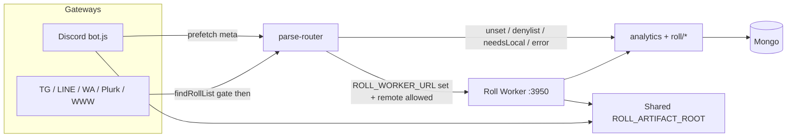

# Roll Worker (Gateway / Backend split)

## Goal

- **Gateways** (Discord / TG / LINE / WA / Plurk / WWW) stay online.
- **Roll Worker** runs `analytics` + `roll/*` and can restart independently.

## Quick start (single machine)

1. Start worker:

```bash
yarn start:roll-worker
```

2. On each gateway process, set:

```env
ROLL_WORKER_URL=http://127.0.0.1:3950
ROLL_WORKER_TOKEN=change-me-shared-secret
```

3. Start gateways as usual (`yarn start` / docker discord vs non-discord).

Without `ROLL_WORKER_URL`, behavior is unchanged (in-process analytics).

**Auth:** set the same `ROLL_WORKER_TOKEN` on worker and every gateway. Worker refuses to start without a token unless `ROLL_WORKER_ALLOW_NO_TOKEN=true` (local tests only; non-loopback bind refused). Gateways attach an HMAC signature (`_gatewayAuth`) over identity and Discord prefetch claims; Worker rejects unsigned/expired bodies when a token is set.

**Artifacts:** Worker should write `export/` and `temp/` under `ROLL_ARTIFACT_ROOT` (default: process cwd). Gateway and Worker must share that directory (same machine cwd or a mounted volume). Gateway skips attach when the file is missing (`assertArtifactReadable`). **Caveat (M9–M11):** `token` uses `getTempFilePath`; wheel GIF, `.st export`, and openai `createFile` still write cwd/`__dirname` temp and can miss the shared root.

**JSON body:** Worker accepts up to `ROLL_WORKER_JSON_LIMIT` (default `32mb`) so Discord `exportHistoryMeta` fits. Override if needed.

**Timeout:** `ROLL_WORKER_TIMEOUT_MS` (default `30000`). Raise for OpenAI / heavy export.

**SSRF:** Worker-side URL fetches (CSV / avatar / story / openai attachments) allowlist Discord CDN hosts and block private/link-local targets via `isSafeImageTarget`. Downloads stream with a hard byte cap (Content-Length reject + incremental read). Redirect follow / IP pinning still open (see M2).

## Env cheat sheet

| Variable | Where | Default / notes |
|----------|--------|-----------------|
| `ROLL_WORKER_URL` | Gateway | unset = local analytics |
| `ROLL_WORKER_TOKEN` | Both | required on Worker unless allow-no-token |
| `ROLL_WORKER_TIMEOUT_MS` | Gateway | `30000` |
| `ROLL_WORKER_HOST` / `PORT` | Worker | `127.0.0.1` / `3950` |
| `ROLL_WORKER_JSON_LIMIT` | Worker | `32mb` |
| `ROLL_ARTIFACT_ROOT` | Both | cwd; must match across processes |
| `ROLL_WORKER_ALLOW_NO_TOKEN` | Worker | tests only; loopback only |
| `ROLL_WORKER_MODE` | Worker (set by `roll-worker.js`) | skips Agenda processor |

## Process tips

| Process | Env focus |
|---------|-----------|
| `yarn start:roll-worker` | `mongoURL`, `ROLL_WORKER_TOKEN`, no platform secrets required |
| Discord gateway | `DISCORD_CHANNEL_SECRET`, `ROLL_WORKER_URL`, `mongoURL` |
| WWW + LINE | `CREATEWEB`, LINE secrets, `ROLL_WORKER_URL` |
| WhatsApp alone | `WHATSAPP_SWITCH`, session volume, `ROLL_WORKER_URL` |

Worker sets `ROLL_WORKER_MODE=true` and **does not** start the Agenda job processor (platforms keep `scheduleAtMessage*` handlers).

Scripts: `yarn test:roll-worker`, `yarn proof:roll-worker`.

## Discord hybrid routing

- **Phase 3j denylist**: any matched Discord module remotes by default; `LOCAL_DISCORD_ONLY` is the only hard block (empty).
- `REMOTE_ALLOWLIST` is documentation of known remote-capable modules.
- Unmatched Discord chat stays local (`isRemoteAllowed(null)` → false).
- Modules that need live Discord return `needsLocal` or use Gateway prefetch meta (token/openai/export/story/forward/chatroom/admin).
- `.st mylist`: Gateway prefetches `storyGroupNamesMeta` for GROUP_ONLY channel/guild display names.
- Still needsLocal (fallback only): missing prefetch meta for Discord-coupled steps (export history, avatar, attachments, cluster/slash/fixshard meta, etc.).
- **Exception:** `openai` never returns `needsLocal` — empty Discord attachment context on Worker falls through to help text (M3).

## Separation status

**Module split is complete (Phase 3 → 3w).** Remaining `needsLocal` paths are intentional Gateway fallbacks when prefetch meta is unavailable — not unfinished remotes. Worker outages fall back to local analytics on all platforms (opt-out: `allowLocalFallback: false`), except mutating modules (`export`, `openai`, `token`, `z_admin`, `z-story-teller`, `forward`, `z_multi-server`) on Worker timeout/error which fail closed (no silent re-run). `needsLocal` local fallback uses `skipExp` so EXP is not double-awarded. Export history prefetch skips GP cooldown / low userrole; empty `sum_messages` does not count as prefetch. Chatroom ManageChannels checks the invoking member via `guild.members.fetch`. `.forward` Gateway fallback live-retries ownership when prefetch flags are false (deleted reply-refs fail closed). Schedule `[[dice]]` uses `skipExp` so cron/at jobs never award channel XP. Non-Discord platforms (including WWW chat) keep local `findRollList` as the command gate so chatter does not hit Worker / award EXP via parse. OpenAI Discord attachment downloads use `safeFetchBuffer` with a 50MB hard cap. `fileLink` / `dmFileLink` attach only paths under `ROLL_ARTIFACT_ROOT`.

## Health

`GET http://127.0.0.1:3950/health`

## Character card (WWW)

`POST /v1/character-action` with `{ doc, item, locale, botname }` — used by WWW socket rolling when `ROLL_WORKER_URL` is set.

---

## Branch review (`Distributed-` vs `master`)

| Field | Value |
|-------|-------|
| Branch tip | `56e2b2fc` Update roll-worker.md |
| Code tip | `e0565b7c` Harden roll-worker fallbacks and fetch limits |
| Base | `master` (`793d1058`) |
| Scope | 71 files, +10288 / −386 · 14 commits · 30 `test/roll-worker*.test.js` |
| Pass 1 | 2026-07-29 — architecture + Bugbot + key-path verify |
| Pass 2 | 2026-07-29 — analytics / Discord bot / client / openai / platforms |
| Pass 3 | 2026-07-29 — full-branch re-verify; docs tip lagged code |
| Pass 4 | 2026-07-29 — full-branch re-review; code unchanged since `e0565b7c` |
| Pass 5 | 2026-07-29 — fresh full-branch re-verify of all open findings + ops accuracy |
| Pass 6 | 2026-07-29 — bug hunt: cross-process RAM caches (dark-roll / level / `.bk`) |
| Pass 7 | 2026-07-29 — bug hunt: artifact writers, `.cmd` RAM, nested needsLocal, slash prefetch |
| Pass 8 | 2026-07-29 — Bugbot + full re-verify; schedule fake-success; statue typo; L10 correction |

### Verdict

Architecture is production-minded and well iterated. Opt-in via `ROLL_WORKER_URL`, Discord hybrid prefetch + `needsLocal`, dual auth, artifact jail, and fail-closed mutators are solid. Phase 3 → 3w is **feature-complete** for the Gateway/Worker split.

**Pass 8:** No new High. Prior H1–H4 / M1–M14 still open (Bugbot reconfirmed). New Medium: remoted `.at`/`.cron` can claim success after swallowed Agenda errors (M15; worse under Worker API-only Agenda). New Low: `statue`/`status` typo drops remoted LevelUp emojis (L14); Discord `{user.displayName}` LevelUp degraded on Worker (L15). **L10 corrected:** `needsLocal` returns before `courtMessage` — only fall-open `workerError` dual-exec inflates metrics. Still safe to iterate behind `ROLL_WORKER_URL`; do not treat remoting as hardened until the fix list below lands.

**Should-fix before production reliance (priority order):**

1. Discord dark-roll: use `darkRolling.getGroupGms` (or reload `TargetGM`) after remoted `.drgm` — H3
2. Cross-process `tempSwitchV2` / level switch sticky cache after remoted `.level config` — H4
3. Expand fail-closed + `skipExp` on `workerError` local fallback (dual-exec / EXP) — H1 + H2
4. Route wheel / `.st export` / openai file writes through `getTempFilePath` — M9–M11
5. Gateway `.bk` / `.cmd` RAM reload or invalidate — M7 + M12
6. Nested `needsLocal` must not re-run parent mutators — M13
7. Defer slash deploy like `fixshard` (not during prefetch) — M14
8. Surface Agenda persist failures on remoted `.at`/`.cron` (and prefer fail-closed for `z_schedule`) — M15 + H2
9. OpenAI Discord: return `needsLocal` when attachments required but prefetch empty — M3
10. WWW `character-action`: fail closed on Worker timeout — M1
11. Harden `safe-fetch` + raise timeout — M2 + M5
12. Fix `statue` ← `status` copy in analytics (L14)

### Architecture overview



| Layer | Behavior |
|-------|----------|
| Opt-in | No `ROLL_WORKER_URL` → in-process analytics (unchanged) |
| Discord | Prefetch meta → Worker; missing meta → `needsLocal` (except openai M3) |
| Other platforms | Remote when enabled + matched; local `findRollList` gates chatter |
| Auth | Bearer `ROLL_WORKER_TOKEN` + HMAC `_gatewayAuth` over signed claims |
| Fail strategy | Default local fallback; 7 mutating modules fail closed on Worker error |
| EXP | `needsLocal` fallback uses `skipExp`; schedule `[[dice]]` uses `skipExp`; `workerError` fallback does **not** (H1) |

### Key modules (`modules/roll-worker/`)

| File | Role |
|------|------|
| `server.js` | Express Worker (`/health`, `/v1/parse`, `/v1/character-action`) |
| `client.js` | Gateway HTTP client + serializable context |
| `parse-router.js` | Remote vs local routing, prefetch enrichment, fallbacks |
| `request-auth.js` | HMAC over signed claims |
| `safe-fetch.js` | Discord CDN allowlist + byte-capped fetch |
| `route-table.js` | Discord denylist (`LOCAL_DISCORD_ONLY`) |
| `discord-prefetch.js` | Discord asset / history / permission prefetch |
| `admin-remote.js` | Admin/root meta + live-sub classifier |
| `artifacts.js` | Shared `ROLL_ARTIFACT_ROOT` path jail |
| `export-history.js` | Empty-history prefetch guard |
| `forward-ownership.js` | Live forward ownership retry |
| `character-action.js` | WWW character roll helper |
| `dark-rolling.js` | Mongo-backed GM list + TTL cache (TG/Line/WA only — Discord still uses process RAM; see H3) |

### Strengths

1. Clear Gateway / Worker split; Discord uses prefetch + `needsLocal` instead of shipping the Discord client to Worker.
2. Dual auth with claim integrity (`userrole` / prefetch metas cannot be rewritten in transit without the secret).
3. Fail-closed for quota / artifact / API mutators: `export`, `openai`, `token`, `z_admin`, `z-story-teller`, `forward`, `z_multi-server`.
4. `skipExp` on `needsLocal` fallback; schedule `[[dice]]` never awards channel XP (`getRoll.js` passes `skipExp: true`, preserved via `remoteParams` on timeout fallback).
5. Artifact path jail; Agenda processor disabled on Worker (`ROLL_WORKER_MODE`).
6. Non-Discord chatter gated locally (avoids Worker / EXP spam), including WWW.
7. Discord gateway side-effects ordered correctly: `clusterIpc` / `gatewayAction` / `adminDm*` / artifact attach via `assertArtifactReadable`.
8. Unusually thorough incremental test suite (`test/roll-worker-phase3*.test.js` through 3w) + `scripts/proof-gateway-worker.js`.
9. Forward deleted reply-refs fail with error (no infinite `needsLocal` loop).
10. `SIGNED_CLAIM_KEYS` covers current `toSerializableContext` / character-action fields.
11. Empty OpenAI / export prefetch arrays correctly treated as “not prefetched”.
12. Worker refuses `ALLOW_NO_TOKEN` on non-loopback bind.
13. TG/Line/WA dark-roll correctly uses `darkRolling.getGroupGms` + invalidate (Discord does not — H3).

### Open findings

Severity reflects Pass 2 triage; **Pass 3–5 reconfirmed prior IDs**; **Pass 6 added H3–H4 / M7–M8 / L10 / I11**; **Pass 7 added M9–M14 / L11–L13**; **Pass 8 added M15 / L14–L15 / I13 and corrected L10**. Code tip still `e0565b7c` (no code fixes since).

#### High

| ID | Location | Finding |
|----|----------|---------|
| H1 | `parse-router.js:168-176` | On Worker timeout/5xx, `runLocalFallback()` runs **without `skipExp`**. `needsLocal` path correctly sets `skipExp: true`; `workerError` does not. |
| H2 | `parse-router.js:191-199` + fall-open modules | Fail-closed set incomplete for DB mutators. Timeout can re-run: `z_schedule`, `z_character`, `z_saveCommand`, `z_random_ans`, `z_trpgDatabase`, `z_event`, `z_Level_system` → duplicate Agenda jobs / DB writes / divergent dice. |
| H3 | `discord/bot.js:525,1161-1168` vs `dark-rolling.js` + `parse-router.js:215-222` | Remoted `.drgm` updates Mongo on Worker; `invalidateDarkRollingIfNeeded` only clears `dark-rolling.js`. Discord still reads process-local `TargetGM` from `z_DDR_darkRollingToGM.initialize()`. `ddr`/`dddr` can DM wrong/missing GMs until Discord restart. TG/Line/WA OK. |
| H4 | `level.js:65-66,81-83` + `z_Level_system.js:456-496` | Remoted `.level config on` updates Worker `tempSwitchV2` only. If Gateway already cached `{ SwitchV2: false }` (common after chatter/`nonDice` while level was off), Gateway EXPUP sticky-returns and **never re-reads Mongo** → channel chatter XP stays off until process restart. Config off is softer (`gpInfoCache` ≤5m). Happens on *successful* remote, not only timeout. |

**H1 nuance:** Cross-process double-XP is *usually* blocked by `LastSpeakTime` 1‑min gate in level.js. Still dual-exec for dice text and side effects; DEBUG/`TOCTOU` can still double XP. Treat as **High for dual-exec**, Medium if XP-only. Schedule/`getRoll` is exempt (already `skipExp`).

#### Medium

| ID | Location | Finding |
|----|----------|---------|
| M1 | `core-www.js:40-48` + `character-action.js:26-32` | `resolveCharacterAction` always local-retries on Worker failure. Nested `analytics.parseInput` can apply twice if Worker completed before timeout. |
| M2 | `safe-fetch.js:105-133` | URL is SSRF-checked (`isSafeImageTarget` DNS), then `fetch(url)` follows redirects by default. `resolvePublicFetchTarget` exists in `utils/is-image-url.js` but is unused here (no IP pinning / no redirect re-validate). |
| M3 | `roll/openai.js` (no `needsLocal` symbol) | **No `needsLocal` anywhere in openai.** Bare Discord `.ai*` (no arg / reply / attachments) on Worker with empty prefetch hits help → **HTTP 200 help text** — Gateway does **not** fall back. **Nuance (Pass 5):** with a text arg (`.ai …`) and empty prefetch, attachment processing is skipped and the command continues text-only (silent attachment drop). |
| M4 | `analytics.js:270-284` + `route-table.js:61-70` | Discord Worker “live client” guard is **dead**: `isRemoteAllowed` always returns true for matched modules (`LOCAL_DISCORD_ONLY` empty). Safety depends entirely on each module’s self-check. |
| M5 | `client.js:6-16` | Default `ROLL_WORKER_TIMEOUT_MS=30000` too short for OpenAI / heavy export → timeout while Worker may already have spent quota / written artifacts (fail-closed UX) or dual-exec for fall-open modules. |
| M6 | Timeout race (design) | Axios abort does not cancel Worker `analytics.parseInput`. Fall-open → divergent results; fail-closed → charged + `system_busy`. |
| M7 | `roll/z_stop.js` RAM + `analytics.js:834-849` | Remoted `.bk add/del` updates Worker `save.save` + Mongo. Gateway `z_stop()` still uses stale `initialize().save`. Happy-path remotes use Worker’s list; local/fallback parses can miss new blocks or keep deleted ones. |
| M8 | `discord-prefetch.js` export history | Prefetch still pulls channel history when `hasReadPermission === false`, then Worker rejects with `bot_no_permission` — wasted Discord API + large signed body. |
| M9 | `wheel-animator.js:280-285` + `z_random_ans.js:220` | Wheel GIF writes `__dirname/../temp`, **ignores `ROLL_ARTIFACT_ROOT`**. Remoted wheel → Gateway `assertArtifactReadable` misses file → silent no-attach. Token already uses `getTempFilePath`. |
| M10 | `z-story-teller.js:2034-2040` | `.st export` writes `process.cwd()/temp/...` + `dmFileLink`. Same root mismatch → remoted export succeeds but Gateway DM attach skipped. |
| M11 | `openai.js:2323-2329` | `createFile` writes `./temp/...` (cwd), not artifact root. Also **no `mkdir`/ensureTempDir** — missing `temp/` → silent catch failure. Remoted translate/`fileLink` can fail Gateway attach when `ROLL_ARTIFACT_ROOT` ≠ Worker cwd. |
| M12 | `z_saveCommand.js:16-26` (+ mutate paths) | Same class as M7: remoted `.cmd add/edit/del` updates Worker `trpgCommandData` + Mongo; Gateway RAM stays stale. Local/fallback `.cmd` can miss new keywords or keep deleted ones. |
| M13 | `analytics.js:223-234` + `800-810` | Nested `characterReRoll`/`cmd` `rolldice` can return `needsLocal` **after** parent already mutated on Worker. Gateway `needsLocal` fallback re-runs **full** parse → parent state applied twice (e.g. `.ch` + Discord-coupled nested). |
| M14 | `admin-remote.js:200-220` + `parse-router.js:415-427` | Slash deploy (`registeredglobal` / `testregistered` / `removeslashcommands`) **mutates Discord during prefetch**, unlike deferred `fixshard`. Worker timeout → fail-closed `system_busy` but Discord already changed; retry deploys again. |
| M15 | `z_schedule.js:226` (+ cron ~389-403); `runtime/schedule.js:146-148` | Remoted `.at`/`.cron` **report success after Agenda persist fails**: `.schedule(...).catch(...)` / empty `job.save()` catch swallow errors, then still return “added”. Worker skips `agenda.start()` (API only), so cold-start `_ready` races are more likely than in-process Gateway. Combines with H2 fall-open dual-create on timeout. |

#### Low

| ID | Location | Finding |
|----|----------|---------|
| L1 | `server.js:58-59` | Bearer compared with `!==` (not timing-safe). HMAC uses `timingSafeEqual`. |
| L2 | `server.js` JSON + HMAC | Authenticated DoS: default `32mb` JSON + `stableStringify` over huge `exportHistoryMeta`; no request rate limit. |
| L3 | `request-auth.js:100-101` | Future `ts` within window (`Math.abs`) slightly extends effective replay. |
| L4 | `safe-fetch.js:6-9` | Host allowlist is one subdomain deep; `cdn.discord.com` (if Discord migrates) would fail closed. |
| L5 | `artifacts.js:24-52` | Path jail uses string `path.relative`; symlink under root can escape (practical risk low if only Worker writes). |
| L6 | `server.js:64-74` | `/health` unauthenticated — uptime + counters. Fine on loopback; caution if bound publicly. |
| L7 | `roll/z_multi-server.js` | Permission deny still silent `return` when `!role` / `!chatroomChannelMeta.allowed` (legacy UX: user thinks bot ignored them). Prefetch itself returns `{ allowed: false }`. |
| L8 | `request-auth.js` + `server.js:99-104` | Server spreads full body into analytics; future unsigned field would be integrity-blind. Today’s `toSerializableContext` + character-action fields are covered by `SIGNED_CLAIM_KEYS`. |
| L9 | `.env.copy` | Documents URL/TOKEN/TIMEOUT/ARTIFACT/ALLOW_NO_TOKEN; omits `ROLL_WORKER_HOST` / `PORT` / `JSON_LIMIT` (defaults OK; easy to miss when binding non-loopback). |
| L10 | `analytics.js` courtMessage / RollingLog | **Pass 8 correction:** `needsLocal` returns at `analytics.js:186-191` **before** `courtMessage` — Worker does **not** increment court counters on needsLocal. Only fall-open `workerError` dual-exec double-counts platform roll metrics (not gameplay). |
| L11 | `veryImportantPerson.js` VIP cache | No invalidate on VIP writes; 5‑min caches diverge Gateway vs Worker after remoted `.root` VIP/patreon edits → local/prefetch VIP gates lag. |
| L12 | `z-story-teller.js` `.st mylist` | Never `needsLocal` when `storyGroupNamesMeta` missing; Worker shows raw guild IDs (degraded UX, not wrong). |
| L13 | `export.js` wait notice | Remoted export: `discordMessage` null on Worker → “processing” wait notice never sent (quota/file still OK). |
| L14 | `level.js:63,91-111` vs `analytics.js:175` | EXPUP fills **`status`**; analytics copies **`statue`**. Remoted LevelUp status emojis (🧟/🧙/☢) are always empty on TG/WA/Discord DM prefix paths. Pre-existing typo; needsLocal merge of `statue` is dead. |
| L15 | `level.js:214-216` + Worker `discordMessage: null` | Remoted Discord LevelUp with `{user.displayName}` cannot resolve → falls back to stored name (degraded UX). |

#### Info / accepted

| ID | Location | Note |
|----|----------|------|
| I1 | `server.js:94-96` | Early Discord `isRemoteAllowed` 503 is dead while `LOCAL_DISCORD_ONLY` is empty. |
| I2 | Ops | Shared secret = any gateway can impersonate any user (expected mesh model). |
| I3 | Design | Fail-closed timeout: Worker may still complete (quota charged) while user sees `system_busy`. Correct safety choice; UX caveat. |
| I4 | `forward-ownership.js` | Deleted reply-refs fail with error — no infinite needsLocal. OK. |
| I5 | `getRoll.js:24-34` | Schedule `[[dice]]` `skipExp` works; preserved on workerError via `remoteParams`. Not an instance of H1. |
| I6 | `core-*.js` | Dead branches for `shouldSkipLocalFindRollList()` (always false). Harmless leftover. |
| I7 | Platforms | TG/Line/WA/Plurk/WWW wire `parseRouter` correctly; Discord-only side effects stay Discord-only. |
| I8 | `roll/openai.js:3` | Worker loads openai module even without `OPENAI_SWITCH` (`ROLL_WORKER_MODE`). Ensure Worker env has real API keys if remoting openai. |
| I9 | Pass 3–8 | Pass 6–8 added High/Medium beyond Pass 2; M3 impact clarified (200 help / silent drop). |
| I10 | Pass 4–5 | Discord `bot.js` uses `assertArtifactReadable` for export / `fileLink` / `dmFileLink` / `sendImage`; `clusterIpc` + `gatewayAction` ordered after parse. |
| I11 | `core-www.js` Api `?msg=` + `/api/local` | No local `findRollList` gate (unlike WWW socket). Unmatched chatter can hit Worker; usually no EXP without groupid. Doc “WWW chat gated” is accurate for socket only. |
| I12 | Pass 7 | No infinite `needsLocal` loop: Gateway fallback calls local `analytics` (not re-remote). Agenda skip + getRoll `skipExp` still OK. Poll `.st goto/pause` with `discordMessage: null` OK. |
| I13 | `z-story-teller.js` `.st import` | Remoted import also writes Worker-local `roll/storyTeller/*.json`. Mongo payload path is primary (OK); FS-only allow/disallow fallback can diverge Gateway vs Worker. |

### Pass triage

| Pass | Highlights |
|------|------------|
| 1–2 | Architecture + H1/H2, M1–M6, L1–L8 |
| 3–5 | Reconfirm all open; M3 nuance; L9; I10 |
| 6 | **H3–H4**, M7–M8, L10, I11 (cross-process RAM) |
| 7 | **M9–M14**, L11–L13, I12 (artifact path / `.cmd` / nested needsLocal / slash prefetch) |
| 8 | Bugbot reconfirm H1–H4 / M1–M14; **M15** schedule fake-success; **L14–L15**; L10 corrected; I11 + `/api/local`; I13 `.st import` FS |

### Test coverage

**Well covered:** routing, client serialization, HMAC tamper, SSRF host allowlist, byte limits, needsLocal+skipExp, fail-closed openai/export set, artifacts escape, prefetch helpers, live spawn+token, fixshard deferred, schedule skipExp, multi-platform fallback, empty-array prefetch guards, loopback allow-no-token, 32mb JSON body.

**Gaps:**

1. No test that `fetch` refuses redirects (or IP-pinned connect) — highest-value missing security test.
2. No OpenAI `needsLocal` when Discord attachment meta empty (M3: bare help vs text-arg silent drop).
3. No load/DoS test for 32mb signed bodies.
4. `z_schedule` / other DB mutators not in fail-closed tests (H2).
5. `discord/bot.js` integration largely untested at unit level (artifact attach, `gatewayAction`, `clusterIpc`) — relies on proof script / manual.
6. WWW `character-action` double-run path not covered (M1).
7. Timeout vs long OpenAI call not covered (M5).
8. Multi-gateway concurrent fallback races on Mongo not tested.
9. No test that `workerError` local fallback sets `skipExp` (H1) — because it currently does not.
10. No Discord `.drgm` → `ddr` stale-GM test (H3); no remoted `.level config on` → Gateway chatter EXPUP test (H4); no remoted `.bk` / `.cmd` → Gateway local gate test (M7/M12).
11. No remoted wheel / `.st export` / openai file attach under non-cwd `ROLL_ARTIFACT_ROOT` (M9–M11).
12. No nested `characterReRoll` → `needsLocal` dual-mutate test (M13); no slash-deploy timeout after prefetch mutate (M14).
13. No remoted `.at` Agenda-fail → user-visible error test (M15); no `statue`/`status` LevelUp emoji test (L14).

### Recommended fixes (shortest path)

1. **Discord `privateMsgFinder` → `darkRolling.getGroupGms`** (same as TG/Line/WA); keep invalidate (H3).
2. **Invalidate / sync Gateway `tempSwitchV2`** on remoted `.level config` (H4).
3. **`skipExp: true` on `workerError` local fallback** and expand `FAIL_CLOSED_ON_WORKER_ERROR` to DB mutators including `z_schedule` (H1 + H2 + M15).
4. **`getTempFilePath` + ensureTempDir for wheel / `.st export` / openai `createFile`** (M9–M11); token already OK.
5. **Reload `.bk` / `.cmd` from Mongo** (or TTL + invalidate) on Gateway (M7 + M12).
6. **Nested `needsLocal` handoff** — do not re-exec parent mutators on Gateway fallback (M13).
7. **Defer slash deploy** like `fixShardMeta.deferred` + `gatewayAction` (M14).
8. **Propagate Agenda schedule/save errors** to user reply on `.at`/`.cron` (M15).
9. **OpenAI `needsLocal`** when Discord assets required but meta empty (M3).
10. **WWW character-action fail-closed** (M1); **`safe-fetch` redirect/IP pin** (M2); **raise timeout** (M5); skip denied-read export history prefetch (M8).
11. **`result.statue = tempEXPUP?.status`** (L14).
12. Optional: Discord denylist (M4); timing-safe Bearer; rate-limit; Api/`/api/local` `findRollList` (I11); VIP cache invalidate (L11).
13. Ops: loopback / private bind; shared `ROLL_WORKER_TOKEN` + `ROLL_ARTIFACT_ROOT`; higher timeout when remoting openai.

### Focus-area checklist (Pass 8)

| Area | Result |
|------|--------|
| analytics needsLocal / skipExp / Discord guards | needsLocal + LevelUp merge OK; skipExp only on needsLocal fallback; Discord guard dead (M4); nested needsLocal re-exec parent (M13); **statue typo (L14)** |
| discord/bot.js wiring | parseRouter, artifacts, `clusterIpc`, `gatewayAction`, admin DM ordered correctly (I10) |
| Discord dark-roll | **Bug:** `TargetGM` RAM; invalidate misses Discord (H3). TG/Line/WA OK |
| Level / `.bk` / `.cmd` RAM | **Bugs:** sticky level-off (H4); Gateway `.bk` (M7) + `.cmd` (M12) stale |
| Artifact writers | Token OK; **wheel / `.st export` / openai createFile ignore `ROLL_ARTIFACT_ROOT`** (M9–M11); openai no mkdir |
| Admin slash vs fixshard | fixshard deferred OK; **slash deploy mutates in prefetch** (M14) |
| client.js | 503→needsLocal; 5xx/timeout → fallback; default 30s (M5) |
| parse-router fail-closed / fallback | `FAIL_CLOSED` = 7; `workerError` without `skipExp` (H1/H2); no infinite needsLocal (I12) |
| discord-prefetch | Chatroom OK; empty export history OK; denied-read still fetches (M8) |
| forward-ownership | Deleted refs fail closed (I4) |
| getRoll + schedule | `skipExp` OK (I5); Agenda skipped on Worker; **`.at`/`.cron` fake success (M15)** |
| openai/token/export/forward/z_admin | token/export/forward/admin have needsLocal; openai missing (M3) |
| SIGNED_CLAIM_KEYS | Complete for current fields (L8 future risk only) |
| Timeout race Mongo | Fall-open yes (H1/H2/M6); fail-closed still charges (I3) |
| core-* vs Discord | Parse OK (I7); WWW character-action fall-open (M1); Api + `/api/local` ungated (I11) |
| safe-fetch | Host allowlist + DNS OK; redirects / no IP pin (M2) |
| Env / scripts | Cheat sheet vs `.env.copy` gaps (L9); scripts present |
| courtMessage / metrics | needsLocal does **not** double-count (L10 corrected); workerError fall-open can |

### Delivered on this branch (code tip `e0565b7c`)

| Area | What landed |
|------|-------------|
| Backend | `roll-worker.js` + Express `/health`, `/v1/parse`, `/v1/character-action` |
| Routing | `parse-router` remote/local + Discord prefetch enrichment + fail-closed mutators |
| Auth | Bearer + HMAC `_gatewayAuth` over `SIGNED_CLAIM_KEYS` |
| Discord hybrid | Prefetch metas (token/openai/export/story/forward/chatroom/admin) + `needsLocal` |
| Artifacts | Shared `ROLL_ARTIFACT_ROOT` jail; Gateway attach gated by `assertArtifactReadable` |
| Safety | Discord CDN allowlist fetch + byte caps; empty-array prefetch guards; loopback-only allow-no-token |
| Platforms | TG/Line/WA/Plurk/WWW + Discord bot + schedule `[[dice]]` `skipExp` |
| Tests | Phase 3 → 3w Jest suites + `scripts/proof-gateway-worker.js` |

### Commits in scope (`master..Distributed-`)

```
56e2b2fc Update roll-worker.md
520b7338 Update roll-worker.md
e0565b7c Harden roll-worker fallbacks and fetch limits
e89e1395 Add Phase 3v fallback, WWW gate, and OpenAI cap
fa809998 Harden roll worker auth and fetch safety
ae9d98c8 Add forward live retry and schedule skipExp
eb074b8b Fix member fetch and export prefetch gating
82245721 Enable local fallback for all worker outages
0e88acba Complete roll-worker Phase 3m to 3o
efabdbdf Harden roll worker auth and artifact handling
df748e8a Expand Discord worker routing with prefetch
6ec8754d Expand roll-worker Discord remote coverage
2e79d5d8 Localize busy reply and log fallback events
874e2f82 Add roll worker backend and parse routing
```
