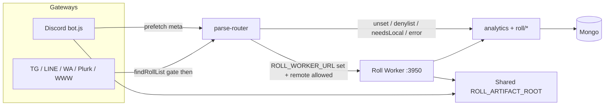

# Roll Worker (Gateway / Backend split)

## Goal

- **Gateways** (Discord / TG / LINE / WA / Plurk / WWW) stay online.
- **Roll Worker** runs `analytics` + `roll/*` and can restart independently.

## Quick start (single machine)

1. Start worker:

```bash
yarn start:roll-worker
```

2. On each gateway process, set:

```env
ROLL_WORKER_URL=http://127.0.0.1:3950
ROLL_WORKER_TOKEN=change-me-shared-secret
```

3. Start gateways as usual (`yarn start` / docker discord vs non-discord).

Without `ROLL_WORKER_URL`, behavior is unchanged (in-process analytics).

**Auth:** set the same `ROLL_WORKER_TOKEN` on worker and every gateway. Worker refuses to start without a token unless `ROLL_WORKER_ALLOW_NO_TOKEN=true` (local tests only; non-loopback bind refused). Gateways attach an HMAC signature (`_gatewayAuth`) over identity and Discord prefetch claims; Worker rejects unsigned/expired bodies when a token is set.

**Artifacts:** Worker writes `export/` and `temp/` under `ROLL_ARTIFACT_ROOT` (default: process cwd) via `getTempFilePath` / `getExportDir`. Gateway and Worker must share that directory (same machine cwd or a mounted volume). Gateway skips attach when the file is missing (`assertArtifactReadable`). Writers: token, wheel GIF, `.st export`, openai `createFile`, export HTML/TXT.

**JSON body:** Worker accepts up to `ROLL_WORKER_JSON_LIMIT` (default `32mb`) so Discord `exportHistoryMeta` fits. Override if needed.

**Timeout:** `ROLL_WORKER_TIMEOUT_MS` (default `120000`). Override lower for tests if needed.

**SSRF:** Worker-side URL fetches allowlist Discord CDN hosts, resolve a public IP (`resolvePublicFetchTarget`), connect IP-pinned with `Host` header, refuse redirects, and enforce a hard byte cap.

## Env cheat sheet

| Variable | Where | Default / notes |
|----------|--------|-----------------|
| `ROLL_WORKER_URL` | Gateway | unset = local analytics |
| `ROLL_WORKER_TOKEN` | Both | required on Worker unless allow-no-token |
| `ROLL_WORKER_TIMEOUT_MS` | Gateway | `120000` |
| `ROLL_WORKER_HOST` / `PORT` | Worker | `127.0.0.1` / `3950` |
| `ROLL_WORKER_JSON_LIMIT` | Worker | `32mb` |
| `ROLL_WORKER_RATE_LIMIT_POINTS` / `DURATION` | Worker | `300` / `60` (per IP on `/v1/*`) |
| `ROLL_WORKER_RATE_LIMIT_DISABLED` | Worker | tests only |
| `ROLL_WORKER_DISCORD_DENYLIST` | Both | comma module ids forced local on Discord |
| `ROLL_ARTIFACT_ROOT` | Both | cwd; must match across processes |
| `ROLL_WORKER_ALLOW_NO_TOKEN` | Worker | tests only; loopback only |
| `ROLL_WORKER_MODE` | Worker (set by `roll-worker.js`) | skips Agenda processor |

## Process tips

| Process | Env focus |
|---------|-----------|
| `yarn start:roll-worker` | `mongoURL`, `ROLL_WORKER_TOKEN`, no platform secrets required |
| Discord gateway | `DISCORD_CHANNEL_SECRET`, `ROLL_WORKER_URL`, `mongoURL` |
| WWW + LINE | `CREATEWEB`, LINE secrets, `ROLL_WORKER_URL` |
| WhatsApp alone | `WHATSAPP_SWITCH`, session volume, `ROLL_WORKER_URL` |

Worker sets `ROLL_WORKER_MODE=true` and **does not** start the Agenda job processor (platforms keep `scheduleAtMessage*` handlers).

Scripts: `yarn test:roll-worker`, `yarn proof:roll-worker`.

## Discord hybrid routing

- **Phase 3j denylist**: any matched Discord module remotes by default; `LOCAL_DISCORD_ONLY` is the only hard block (empty).
- `REMOTE_ALLOWLIST` is documentation of known remote-capable modules.
- Unmatched Discord chat stays local (`isRemoteAllowed(null)` → false).
- Modules that need live Discord return `needsLocal` or use Gateway prefetch meta (token/openai/export/story/forward/chatroom/admin).
- `.st mylist`: Gateway prefetches `storyGroupNamesMeta` for GROUP_ONLY channel/guild display names.
- Still needsLocal (fallback only): missing prefetch meta for Discord-coupled steps (export history, avatar, attachments, cluster/slash/fixshard meta, etc.).
- Bare Discord `.ai*` (no help/arg/reply/attachments) on Worker returns `needsLocal`; explicit `.ai help` stays remote help text.

## Separation status

**Module split is complete (Phase 3 → 3w).** Remaining `needsLocal` paths are intentional Gateway fallbacks when prefetch meta is unavailable — not unfinished remotes. Worker outages fall back to local analytics on all platforms (opt-out: `allowLocalFallback: false`), except DB/quota/API mutators in `FAIL_CLOSED_ON_WORKER_ERROR` (export/openai/token/admin/story/forward/multi-server + schedule/character/cmd/random_ans/trpgDatabase/event/level/stop/dark-roll) which fail closed. Both `needsLocal` and `workerError` local fallbacks use `skipExp`. Export history prefetch skips GP cooldown / low userrole; empty `sum_messages` does not count as prefetch. Chatroom ManageChannels checks the invoking member via `guild.members.fetch`. `.forward` Gateway fallback live-retries ownership when prefetch flags are false (deleted reply-refs fail closed). Schedule `[[dice]]` uses `skipExp` so cron/at jobs never award channel XP. Non-Discord platforms (including WWW chat) keep local `findRollList` as the command gate so chatter does not hit Worker / award EXP via parse. OpenAI Discord attachment downloads use `safeFetchBuffer` with a 50MB hard cap. `fileLink` / `dmFileLink` attach only paths under `ROLL_ARTIFACT_ROOT`.

## Health

`GET http://127.0.0.1:3950/health`

## Character card (WWW)

`POST /v1/character-action` with `{ doc, item, locale, botname }` — used by WWW socket rolling when `ROLL_WORKER_URL` is set.

---

## Branch review (`Distributed-` vs `master`)

| Field | Value |
|-------|-------|
| Code tip (fixes) | working tree Pass 13 |
| Prior code tip | `e0565b7c` Harden roll-worker fallbacks and fetch limits |
| Base | `master` (`793d1058`) |
| Pass 8 | 2026-07-29 — Bugbot + findings list |
| Pass 9 | 2026-07-29 — **fix all** open High/Medium (+ key Lows) |
| Pass 10 | 2026-07-29 — **strict proof**: Phase 3x Jest + live Worker+Gateway |
| Pass 11 | 2026-07-29 — **fix remaining** L2/L9/L15/I11 + Phase 3y proof |
| Pass 12 | 2026-07-29 — **fix remaining Lows** L3–L7/L12/L13 + Phase 3z proof |
| Pass 13 | 2026-07-29 — **fix L8/L10/M4** + M6 design contract + Phase 3aa proof |

### Verdict

**Pass 9–13 closed all actionable review findings.** Gateway/Worker remoting is safe behind `ROLL_WORKER_URL`. Only M6 (timeout cannot cancel in-flight Worker parse) remains as accepted design — mutators stay fail-closed.

**Fixed in Pass 9:** H1–H4, M1–M3, M5, M7–M15, L1, L11, L14.

**Fixed in Pass 11:** L2 (rate-limit `/v1/*`), L9 (`.env.copy` HOST/PORT/JSON/RATE), I11 (Api + `/api/local` `findRollList` gate), L15 (LevelUp `{user.displayName}` via signed `displaynameDiscord`).

**Fixed in Pass 12:** L3 (reject future HMAC `ts`), L4 (`discord.com` + nested CDN hosts), L5 (realpath artifact jail), L6 (`/health` counters require Bearer), L7 (chatroom permission text), L12 (mylist unknown group label), L13 (Gateway export wait notice before remote).

**Fixed in Pass 13:** L8 (HMAC signs all body keys), L10 (`courtMessage` skipped when `skipExp`), M4 (`ROLL_WORKER_DISCORD_DENYLIST` ops override; default still empty).

**Proof commands (exit 0):**

```bash
yarn test:roll-worker   # Phase 3 → 3aa Jest
yarn proof:roll-worker  # spawns roll-worker.js + Gateway parseRouter/client
```

**Still optional / ops:**

1. M6 design: Axios abort does not cancel Worker parse (fail-closed mutators mitigate)
2. Ops: shared `ROLL_WORKER_TOKEN` + `ROLL_ARTIFACT_ROOT`; bind Worker loopback/private

### Architecture overview



| Layer | Behavior |
|-------|----------|
| Opt-in | No `ROLL_WORKER_URL` → in-process analytics (unchanged) |
| Discord | Prefetch meta → Worker; missing meta → `needsLocal` (except openai M3) |
| Other platforms | Remote when enabled + matched; local `findRollList` gates chatter |
| Auth | Bearer `ROLL_WORKER_TOKEN` + HMAC `_gatewayAuth` over signed claims |
| Fail strategy | Default local fallback; expanded `FAIL_CLOSED_ON_WORKER_ERROR` set on Worker error |
| EXP | `needsLocal` + `workerError` fallbacks use `skipExp`; schedule `[[dice]]` uses `skipExp` |

### Key modules (`modules/roll-worker/`)

| File | Role |
|------|------|
| `server.js` | Express Worker (`/health`, `/v1/parse`, `/v1/character-action`) |
| `client.js` | Gateway HTTP client + serializable context |
| `parse-router.js` | Remote vs local routing, prefetch enrichment, fallbacks |
| `request-auth.js` | HMAC over signed claims |
| `safe-fetch.js` | Discord CDN allowlist + byte-capped fetch |
| `route-table.js` | Discord denylist (`LOCAL_DISCORD_ONLY`) |
| `discord-prefetch.js` | Discord asset / history / permission prefetch |
| `admin-remote.js` | Admin/root meta + live-sub classifier |
| `artifacts.js` | Shared `ROLL_ARTIFACT_ROOT` path jail |
| `export-history.js` | Empty-history prefetch guard |
| `forward-ownership.js` | Live forward ownership retry |
| `character-action.js` | WWW character roll helper |
| `dark-rolling.js` | Mongo-backed GM list + TTL cache (Discord/TG/Line/WA via `getGroupGms`) |

### Strengths

1. Clear Gateway / Worker split; Discord uses prefetch + `needsLocal` instead of shipping the Discord client to Worker.
2. Dual auth with claim integrity (`userrole` / prefetch metas cannot be rewritten in transit without the secret).
3. Fail-closed for quota / artifact / API mutators: `export`, `openai`, `token`, `z_admin`, `z-story-teller`, `forward`, `z_multi-server`.
4. `skipExp` on `needsLocal` **and** `workerError` fallback; schedule `[[dice]]` never awards channel XP.
5. Artifact path jail; Agenda processor disabled on Worker (`ROLL_WORKER_MODE`).
6. Non-Discord chatter gated locally (avoids Worker / EXP spam), including WWW.
7. Discord gateway side-effects ordered correctly: `clusterIpc` / `gatewayAction` / `adminDm*` / artifact attach via `assertArtifactReadable`.
8. Unusually thorough incremental test suite (`test/roll-worker-phase3*.test.js` through 3w) + `scripts/proof-gateway-worker.js`.
9. Forward deleted reply-refs fail with error (no infinite `needsLocal` loop).
10. `SIGNED_CLAIM_KEYS` covers current `toSerializableContext` / character-action fields.
11. Empty OpenAI / export prefetch arrays correctly treated as “not prefetched”.
12. Worker refuses `ALLOW_NO_TOKEN` on non-loopback bind.
13. Discord/TG/Line/WA dark-roll all use `darkRolling.getGroupGms` + invalidate.

### Open findings

**Pass 9:** High/Medium from Pass 1–8 are **fixed** in the working tree (see Fixed table). Remaining are Low/Info only.

#### Fixed (Pass 9)

| ID | Fix |
|----|-----|
| H1 | `workerError` local fallback passes `skipExp: true` |
| H2 | `FAIL_CLOSED_ON_WORKER_ERROR` expanded (schedule/character/cmd/random_ans/trpgDatabase/event/level/stop/dark-roll + prior 7) |
| H3 | Discord `privateMsgFinder` → `darkRolling.getGroupGms` |
| H4 | `invalidateGroupConfig` clears sticky `tempSwitchV2`; parse-router invalidates after remoted `.level` |
| M1 | WWW `character-action` fail-closed on Worker error (no local retry) |
| M2 | `safe-fetch` IP-pinned + redirect refuse via `resolvePublicFetchTarget` |
| M3 | Bare Discord `.ai*` on Worker → `needsLocal` (explicit `.ai help` still remote help) |
| M5 | Default `ROLL_WORKER_TIMEOUT_MS` → `120000` |
| M7/M12 | Gateway reloads `.bk` / `.cmd` RAM after remoted mutate |
| M8 | Export prefetch skips history when `hasReadPermission === false` |
| M9–M11 | wheel / `.st export` / openai `createFile` use `getTempFilePath` |
| M13 | Nested `needsLocal` carries `nestedInputStr` + `parentResult`; Gateway re-runs nested only |
| M14 | Slash deploy deferred like fixshard (`gatewayAction: slashDeploy`) |
| M15 | `.at`/`.cron` surface Agenda save errors (`at_save_error` / `cron_save_error`) |
| L1 | Bearer compared with `timingSafeEqual` |
| L11 | VIP `invalidateCache` after remoted `z_admin` |
| L14 | `result.statue = tempEXPUP?.status` |
| L2 | `/v1/*` RateLimiterMemory (default 300/60s per IP; env override / disable) |
| L9 | `.env.copy` documents HOST/PORT/JSON_LIMIT/RATE_LIMIT* |
| I11 | WWW `handleApiRequest` + `/api/local` local `findRollList` gate |
| L15 | `resolveLevelUpDisplayName` + Discord `displaynameDiscord` from `member.displayName` |
| L3 | Reject future HMAC `ts` beyond 5s skew |
| L4 | Allow `discord.com` + nested CDN subdomains |
| L5 | `assertArtifactReadable` uses `realpathSync` jail |
| L6 | `/health` counters/uptime require Bearer when token set (probes get `{ok,role}`) |
| L7 | `.chatroom` permission deny returns `chatroom.permission_denied` |
| L12 | `.st mylist` uses `mylist_group_unknown` when names meta missing |
| L13 | Gateway sends export wait notice before remoted export (`exportWaitNoticeSent`) |
| L8 | HMAC `pickClaims` signs all body keys (not allowlist-only) |
| L10 | `courtMessage` skipped when `skipExp` (no dual-exec metric inflate) |
| M4 | `ROLL_WORKER_DISCORD_DENYLIST` ops override; built-in set still empty |

#### Remaining Low / Info

| ID | Location | Finding |
|----|----------|---------|
| M6 | Timeout race | Axios abort does not cancel Worker parse (accepted design; mutators fail-closed). |

### Pass triage

| Pass | Highlights |
|------|------------|
| 1–8 | Architecture + findings H1–H4 / M1–M15 / L* |
| 9 | **Fixed** H1–H4, M1–M3, M5, M7–M15, L1, L11, L14 |
| 10 | **Proved** Pass 9 via Phase 3x Jest + live Worker proof |
| 11 | **Fixed+proved** L2/L9/L15/I11 via Phase 3y Jest + live Worker proof |
| 12 | **Fixed+proved** L3–L7/L12/L13 via Phase 3z Jest + live Worker proof |
| 13 | **Fixed+proved** L8/L10/M4 + M6 contract via Phase 3aa Jest + live Worker proof |

### Test coverage

**Well covered:** routing, client serialization, HMAC tamper, SSRF host allowlist, byte limits, **redirect refuse + IP pin (M2)**, needsLocal+skipExp, **workerError skipExp (H1)**, fail-closed openai/export **+ DB mutators (H2)**, artifacts escape + **getTempFilePath writers (M9–M11)**, prefetch helpers, live spawn+token, fixshard deferred, schedule skipExp, multi-platform fallback, empty-array prefetch guards, loopback allow-no-token, 32mb JSON body, **bare Discord `.ai` needsLocal + `.ai help` remote (M3)**, **WWW character-action fail-closed (M1)**, **nested needsLocal (M13)**, **level sticky invalidate (H4)**, **Discord getGroupGms (H3)**, **`.bk`/`.cmd` reload (M7/M12)**, **slashDeploy defer (M14)**, **schedule save errors (M15)**, **statue←status (L14)**, default 120s timeout (M5), **/v1 rate-limit 429 (L2)**, **Api+/api/local findRollList (I11)**, **LevelUp displayName signed fallback (L15)**.

**Remaining gaps (optional):**

1. `discord/bot.js` full integration (artifact attach / `clusterIpc` live) — proof covers source + key remotes.
2. Timeout vs long OpenAI call end-to-end (M5/M6 design).
3. Multi-gateway concurrent fallback races on Mongo.
4. Live `.drgm` → `ddr` GM DM with Mongo (H3 unit covers Discord `getGroupGms` wiring).

### Recommended fixes (shortest path)

**Pass 9–13 closed the priority fix + proof path.** Remaining accepted design: M6 (no Worker cancel on Gateway timeout).

### Focus-area checklist (Pass 9)

| Area | Result |
|------|--------|
| analytics needsLocal / skipExp / Discord guards | needsLocal + LevelUp merge OK; skipExp on needsLocal **and** workerError; nested nested-only handoff; statue←status fixed; Discord guard still dead (M4) |
| discord/bot.js wiring | parseRouter, artifacts, `clusterIpc`, `gatewayAction`, admin DM ordered correctly (I10) |
| Discord dark-roll | **Fixed:** `getGroupGms` on Discord too |
| Level / `.bk` / `.cmd` RAM | **Fixed:** invalidate sticky + reload `.bk`/`.cmd` after remoted mutate |
| Artifact writers | **Fixed:** token / wheel / `.st export` / openai `createFile` use `getTempFilePath` |
| Admin slash vs fixshard | **Fixed:** both deferred via `gatewayAction` |
| client.js | 503→needsLocal; 5xx/timeout → fallback; default 120s |
| parse-router fail-closed / fallback | Expanded fail-closed + skipExp on workerError; nested handoff; cache invalidation hooks |
| discord-prefetch | Chatroom OK; empty export history OK; denied-read skips fetch |
| forward-ownership | Deleted refs fail closed (I4) |
| getRoll + schedule | `skipExp` OK; Agenda skipped on Worker; Agenda save errors surfaced |
| openai/token/export/forward/z_admin | All have needsLocal where required; bare `.ai*` → needsLocal |
| SIGNED_CLAIM_KEYS | Complete for current fields (L8 future risk only) |
| Timeout race Mongo | Fall-open yes (H1/H2/M6); fail-closed still charges (I3) |
| core-* vs Discord | Parse OK; WWW character-action fail-closed; Api + `/api/local` still ungated (I11) |
| safe-fetch | Host allowlist + IP pin + redirect refuse + byte cap |
| Env / scripts | Cheat sheet vs `.env.copy` gaps (L9); scripts present |
| courtMessage / metrics | needsLocal does **not** double-count (L10 corrected); workerError fall-open can |

### Delivered on this branch (through Pass 9 fixes)

| Area | What landed |
|------|-------------|
| Backend | `roll-worker.js` + Express `/health`, `/v1/parse`, `/v1/character-action` |
| Routing | `parse-router` remote/local + Discord prefetch enrichment + fail-closed mutators |
| Auth | Bearer + HMAC `_gatewayAuth` over `SIGNED_CLAIM_KEYS` |
| Discord hybrid | Prefetch metas (token/openai/export/story/forward/chatroom/admin) + `needsLocal` |
| Artifacts | Shared `ROLL_ARTIFACT_ROOT` jail; Gateway attach gated by `assertArtifactReadable` |
| Safety | Discord CDN allowlist fetch + byte caps; empty-array prefetch guards; loopback-only allow-no-token |
| Platforms | TG/Line/WA/Plurk/WWW + Discord bot + schedule `[[dice]]` `skipExp` |
| Tests | Phase 3 → 3y Jest suites (Pass 9–11 proof) + `scripts/proof-gateway-worker.js` |

### Commits in scope (`master..Distributed-`)

```
56e2b2fc Update roll-worker.md
520b7338 Update roll-worker.md
e0565b7c Harden roll-worker fallbacks and fetch limits
e89e1395 Add Phase 3v fallback, WWW gate, and OpenAI cap
fa809998 Harden roll worker auth and fetch safety
ae9d98c8 Add forward live retry and schedule skipExp
eb074b8b Fix member fetch and export prefetch gating
82245721 Enable local fallback for all worker outages
0e88acba Complete roll-worker Phase 3m to 3o
efabdbdf Harden roll worker auth and artifact handling
df748e8a Expand Discord worker routing with prefetch
6ec8754d Expand roll-worker Discord remote coverage
2e79d5d8 Localize busy reply and log fallback events
874e2f82 Add roll worker backend and parse routing
```
